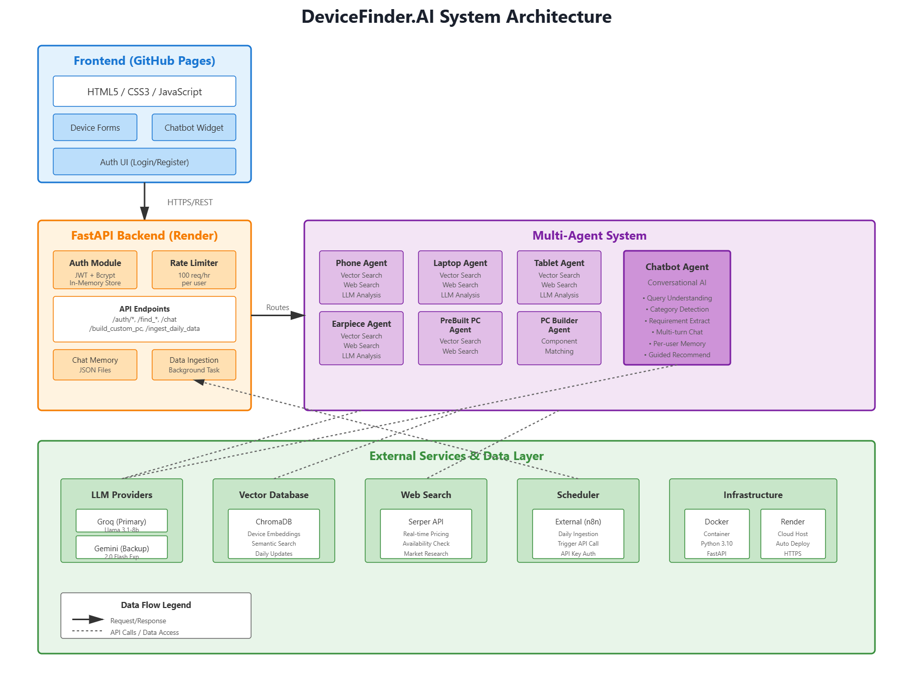

# DeviceFinder.AI

> **AI-Powered Multi-Agent Device Recommendation System**



DeviceFinder.AI is an MVP application that leverages multiple specialized AI agents to help users find and compare electronic devices. Built with FastAPI and vanilla JavaScript, it provides intelligent recommendations for phones, laptops, tablets, earpieces, pre-built PCs, and custom PC builds.

[](https://raevmood.github.io/final-frontend/)
[](https://final-project-4a2l.onrender.com)
[](https://www.python.org/)
[](https://fastapi.tiangolo.com/)

---

## 🚀 Features

### Core Functionality
- **6 Specialized AI Agents**: Each agent is optimized for a specific device category
  - Phone Agent
  - Laptop Agent  
  - Tablet Agent
  - Earpiece/Headphone Agent
  - Pre-built PC Agent
  - Custom PC Builder Agent
- **Conversational Chatbot**: AI assistant with per-user conversation memory and MCP access to a Retriever tool
- **Vector Database Search**: ChromaDB-powered semantic search for device matching
- **Real-time Web Search**: Serper API integration for up-to-date pricing and availability
- **Email Recommendations**: Send device recommendations directly to user email

### Technical Features
- **JWT Authentication**: In-memory token-based auth (MVP implementation)
- **Rate Limiting**: Per-user LLM request limits (configurable, default: 100/hour)
- **Dual LLM Support**: Primary (Groq Llama 3.1) with automatic fallback (Gemini 2.0)
- **Background Ingestion**: Scheduled vector database updates via external triggers
- **CORS Enabled**: Supports GitHub Pages frontend deployment

---

## 🏗️ Architecture

### Backend Stack
- **Framework**: FastAPI (Python 3.10+)
- **LLMs**: Groq (Llama 3.1-8b-instant) + Google Gemini 2.0 (backup)
- **Vector DB**: ChromaDB for device embeddings
- **Search**: Serper API for real-time web search
- **Auth**: JWT with bcrypt password hashing (in-memory user store)
- **Deployment**: Dockerized on Render
- **MCP**: Chatbot access to context
### Frontend Stack
- **Tech**: Vanilla HTML5, CSS3, JavaScript (ES6+)
- **Hosting**: GitHub Pages
- **Features**: Tab-based UI, floating chatbot widget, responsive design

### Agent Architecture
Each agent follows a multi-step reasoning process:
1. **Input Processing**: Parse user requirements and preferences
2. **Vector Search**: Query ChromaDB for relevant devices
3. **Web Search**: Fetch real-time pricing/availability (Serper API)
4. **LLM Analysis**: Generate recommendations with detailed reasoning
5. **JSON Output**: Structured response with device specs and links

---

## 📋 Prerequisites

- Python 3.10+
- pip (Python package manager)
- Git
- API Keys:
  - Google Gemini API key
  - Groq API key
  - Serper API key

---

## 🔧 Installation & Setup

### 1. Clone the Repository
```bash
git clone https://github.com/raevmood/final-project.git
cd final-project
```

### 2. Install Dependencies
```bash
pip install -r requirements.txt
```

**Dependencies:**
```
langchain-google-genai
langchain-groq
python-dotenv
fastapi
uvicorn
chromadb
pysqlite3-binary
python-jose[cryptography]==3.3.0
python-multipart==0.0.6
pydantic[email]
cryptography
bcrypt==4.1.2
passlib[bcrypt]==1.7.4
requests
langchain
```

### 3. Environment Configuration
Create a `.env` file in the project root:

```env
# Required API Keys
GOOGLE_API_KEY=your_gemini_api_key_here
GROQ_API_KEY=your_groq_api_key_here
SERPER_API_KEY=your_serper_api_key_here

# Security Keys
SECRET_KEY=your_32_character_secret_key_for_jwt
INGESTION_API_KEY=your_random_password_for_ingestion_endpoint

# Rate Limiting (Optional - defaults shown)
LLM_MAX_REQUESTS_PER_HOUR=100
LLM_RATE_LIMIT_WINDOW_MINUTES=60
```

**How to get API keys:**
- **Google Gemini**: [Google AI Studio](https://makersuite.google.com/app/apikey)
- **Groq**: [Groq Console](https://console.groq.com/)
- **Serper**: [Serper.dev](https://serper.dev/)

### 4. Run Locally
```bash
uvicorn main:app --reload --host 0.0.0.0 --port 8000
```

Access the API:
- **API**: http://localhost:8000
- **Swagger Docs**: http://localhost:8000/docs
- **ReDoc**: http://localhost:8000/redoc

---

## 🐳 Docker Deployment

### Build Image
```bash
docker build -t devicefinder-api .
```

### Run Container
```bash
docker run -p 8000:8000 \
  -e GOOGLE_API_KEY=your_key \
  -e GROQ_API_KEY=your_key \
  -e SERPER_API_KEY=your_key \
  -e SECRET_KEY=your_secret \
  -e INGESTION_API_KEY=your_ingestion_key \
  devicefinder-api
```

### Deploy to Render
1. Push code to GitHub
2. Create new Web Service on [Render](https://render.com)
3. Connect repository
4. Set environment variables in Render dashboard
5. Deploy (automatic from Dockerfile)

**Render Configuration:**
- **Build Command**: `docker build`
- **Start Command**: Defined in Dockerfile
- **Environment**: Add all variables from `.env`

---

## 📡 API Endpoints

### Authentication
| Method | Endpoint | Description | Auth Required |
|--------|----------|-------------|---------------|
| POST | `/auth/register` | Register new user | No |
| POST | `/auth/login` | Login and get JWT token | No |

### Device Search Agents
All device endpoints require JWT authentication via `Authorization: Bearer <token>` header.

| Method | Endpoint | Description |
|--------|----------|-------------|
| POST | `/find_phone` | Get phone recommendations |
| POST | `/find_laptop` | Get laptop recommendations |
| POST | `/find_tablet` | Get tablet recommendations |
| POST | `/find_earpiece` | Get earpiece/headphone recommendations |
| POST | `/find_prebuilt_pc` | Get pre-built PC recommendations |
| POST | `/build_custom_pc` | Get custom PC build recommendations |

### Chatbot
| Method | Endpoint | Description | Auth Required |
|--------|----------|-------------|---------------|
| POST | `/chat` | Conversational AI assistant | Yes |
| DELETE | `/chat/clear_history` | Clear user's chat history | Yes |

### System
| Method | Endpoint | Description | Auth Required |
|--------|----------|-------------|---------------|
| GET | `/` | API status and info | No |
| POST | `/ingest_daily_data` | Trigger vector DB ingestion | API Key (X-API-KEY header) |

**Detailed API documentation available at `/docs` when running.**

---

## 🔐 Authentication Flow

### 1. Register a User
```bash
curl -X POST "http://localhost:8000/auth/register" \
  -H "Content-Type: application/json" \
  -d '{
    "username": "testuser",
    "email": "test@example.com",
    "password": "securepassword123"
  }'
```

### 2. Login
```bash
curl -X POST "http://localhost:8000/auth/login" \
  -H "Content-Type: application/json" \
  -d '{
    "username": "testuser",
    "password": "securepassword123"
  }'
```

Response:
```json
{
  "access_token": "eyJhbGciOiJIUzI1NiIsInR5cCI6IkpXVCJ9...",
  "token_type": "bearer",
  "username": "testuser"
}
```

### 3. Use Authenticated Endpoints
```bash
curl -X POST "http://localhost:8000/find_phone" \
  -H "Authorization: Bearer YOUR_JWT_TOKEN" \
  -H "Content-Type: application/json" \
  -d '{
    "user_base_prompt": "a powerful gaming phone",
    "location": "Nairobi, Kenya",
    "budget": 1000
  }'
```

---

## 💡 Example Usage

### Find a Gaming Laptop
```json
POST /find_laptop
Authorization: Bearer <token>

{
  "user_base_prompt": "high-performance laptop for gaming and video editing",
  "location": "New York, USA",
  "budget": 2000,
  "ram": "16GB",
  "gpu": "RTX 4060",
  "usage": "gaming",
  "preferred_brands": ["ASUS", "MSI", "Lenovo"]
}
```

### Chatbot Conversation
```json
POST /chat
Authorization: Bearer <token>

{
  "message": "I need a phone with excellent camera quality under $800"
}
```

Response:
```json
{
  "response": "I'd be happy to help you find a phone with excellent camera quality under $800! To give you the best recommendations, could you tell me:\n\n1. What's your location?\n2. Any brand preferences?\n3. What will you primarily use the camera for (portraits, landscapes, video, etc.)?"
}
```

---

## ⚙️ Configuration

### Rate Limiting
Control per-user LLM request limits via environment variables:

```env
LLM_MAX_REQUESTS_PER_HOUR=100          # Max requests per user
LLM_RATE_LIMIT_WINDOW_MINUTES=60      # Rolling window in minutes
```

**Default**: 100 requests per 60-minute rolling window per user.

### LLM Fallback Strategy
1. **Primary**: Groq (Llama 3.1-8b-instant) - Fast, cost-effective
2. **Backup**: Google Gemini 2.0 Flash - Automatic fallback on primary failure

### CORS Configuration
Current allowed origins (edit in `main.py`):
```python
origins = [
    "http://localhost:8000",
    "https://raevmood.github.io/final-frontend",
    "https://raevmood.github.io"
]
```

---

## 📊 Data Ingestion

The `/ingest_daily_data` endpoint populates the vector database with fresh device data.

**Trigger via cron job or scheduler (e.g., n8n):**
```bash
curl -X POST "https://your-api.onrender.com/ingest_daily_data" \
  -H "X-API-KEY: your_ingestion_api_key"
```

**Recommended Schedule**: Daily at 2 AM UTC

---

## 🧪 Testing

### Test User (Development)
A test user is automatically created on startup:
- **Username**: `testuser`
- **Password**: `testpassword`

### Manual Testing via Swagger UI
1. Navigate to `http://localhost:8000/docs`
2. Click "Authorize" button
3. Login to get JWT token
4. Use token for authenticated endpoints

---

## ⚠️ Known Limitations (MVP)

1. **Authentication**: In-memory JWT storage (sessions lost on restart)
2. **No Cookie Persistence**: Users must login on every visit
3. **Manual Agent Selection**: App doesn't auto-route queries to appropriate agent
4. **No Database**: User data and chat history stored in memory/JSON files
5. **Rate Limits Reset**: Rate limit counters reset on server restart
6. **Single Instance**: Not designed for horizontal scaling

**Production Recommendations:**
- Implement PostgreSQL/MySQL for user storage
- Add Redis for session management and rate limiting
- Implement query routing logic to auto-select agents
- Add cookie-based session persistence
- Use persistent storage for chat history (database or S3)

---

## 📁 Project Structure

```
final-project/
├── main.py                 # FastAPI application entry point
├── auth_routes.py          # Authentication endpoints
├── auth_utils.py           # JWT token utilities
├── user_store.py           # In-memory user management
├── llm_provider.py         # LLM integration with rate limiting
├── vector_db_tool.py       # ChromaDB vector search
├── serper_tool.py          # Web search integration
├── device_agents.py        # Specialized agent implementations
├── chatbot.py              # Conversational AI assistant
├── memory.py               # Chat memory management (JSON files)
├── data_ingestor.py        # Vector DB ingestion logic
├── requirements.txt        # Python dependencies
├── Dockerfile              # Docker configuration
├── .env                    # Environment variables (not in repo)
├── chroma_db/              # Vector database storage (created on first run)
└── chat_memory/            # Per-user chat history JSON files
```

---

## 🤝 Contributing

This is an MVP project. Contributions are welcome for:
- Database integration (PostgreSQL/MongoDB)
- Frontend framework migration (React/Vue)
- Improved agent reasoning
- Additional device categories
- Test coverage

**Fork** → **Create Feature Branch** → **Commit** → **Push** → **Pull Request**

---

## 📄 License

This project is provided as-is for educational and demonstration purposes. No formal license specified.

---

## 🔗 Links

- **Live Demo**: https://raevmood.github.io/final-frontend/
- **API Endpoint**: https://final-project-4a2l.onrender.com
- **Repository**: https://github.com/raevmood/final-project
- **API Documentation**: https://final-project-4a2l.onrender.com/docs

---

## 🐛 Troubleshooting

### ChromaDB Permission Errors
```bash
mkdir -p chroma_db
chmod -R 777 chroma_db
```

### Port Already in Use
```bash
# Kill process on port 8000
lsof -ti:8000 | xargs kill -9
```

### API Key Errors
Verify all required keys are set:
```bash
python -c "from dotenv import load_dotenv; import os; load_dotenv(); print('Keys loaded' if all([os.getenv('GOOGLE_API_KEY'), os.getenv('GROQ_API_KEY'), os.getenv('SERPER_API_KEY')]) else 'Missing keys')"
```

### Rate Limit Exceeded
Wait for the rolling window to reset, or adjust limits in `.env`:
```env
LLM_MAX_REQUESTS_PER_HOUR=200  # Increase limit
```

---

## 📞 Contact & Support

For issues or questions:
1. Check [API Documentation](https://final-project-4a2l.onrender.com/docs)
2. Review this README
3. Open an issue on [GitHub](https://github.com/raevmood/final-project/issues)

---

**Built using FastAPI, LangChain, and Groq/Gemini LLMs**